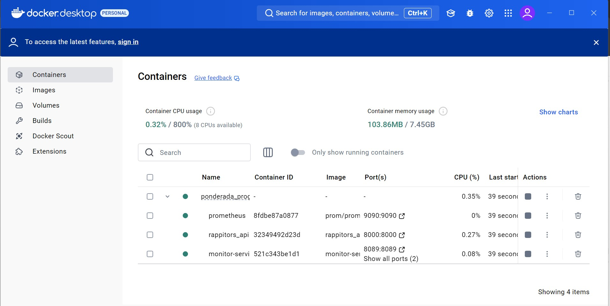
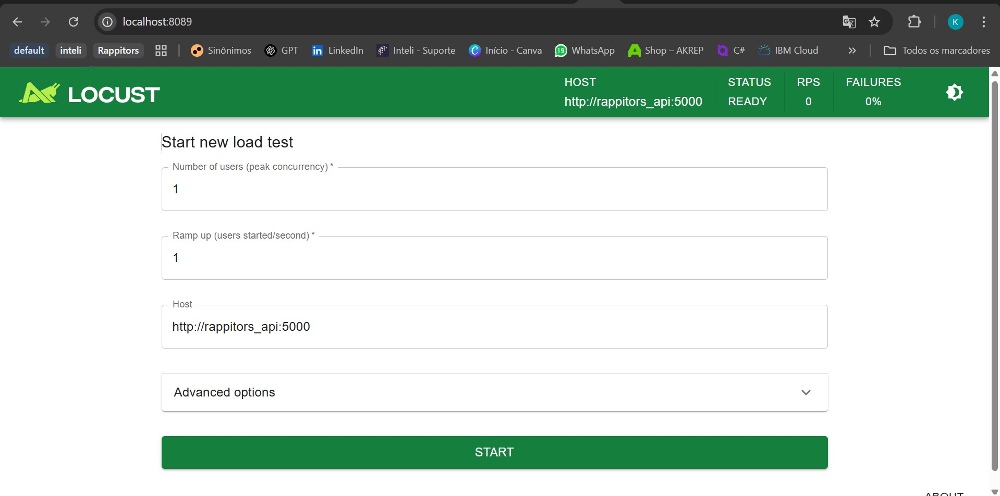
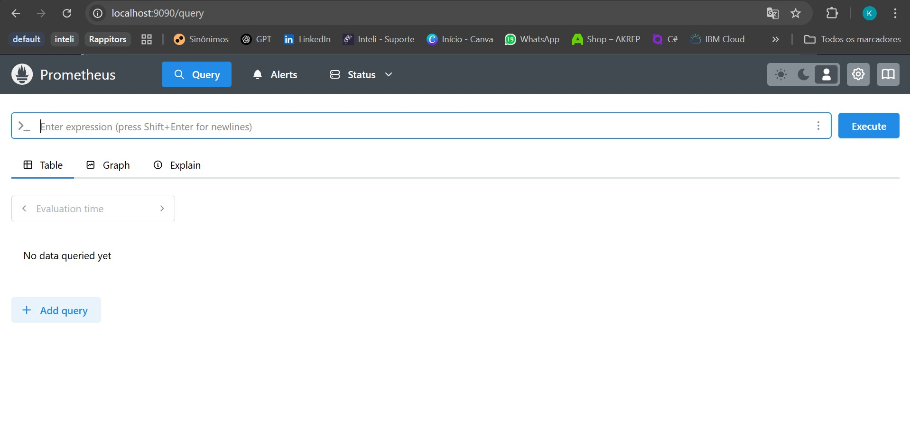
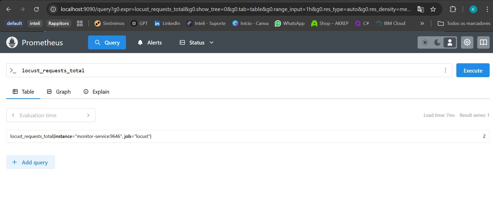
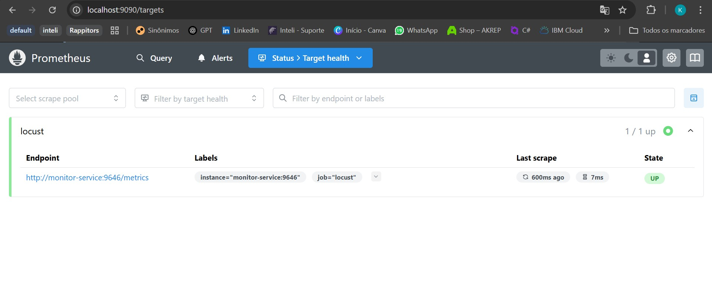

# Ponderada de Programação

Engenharia de Software - Módulo 09 - Semana 03 

## BDD e Engenharia de Integração - Ponderada 3

Kaiane Souza Cordeiro - (turma 09)

> O código e estrutura de pastas segue a lógica da minha contribuição como desenvedora do grupo 5 (Rappitors). Utilizei da estrutura base para aprofundar o conhecimento de BDD e Engenharia de Integração.

Para rodar:
```
cd src 
docker-compose up --build -d
```

obs: coloque o [arquivo de credenciais](https://drive.google.com/file/d/1ERj98PoCOa4tzDmaxX0FFMESldcTcw4S/view?usp=sharing) na pasta config para conseguir rodar localmente.

## Engenharia de Integração
#### O que é Engenharia de Integração?
A **Engenharia de Integração** é a prática de conectar diferentes sistemas, serviços e aplicações para garantir que eles funcionem de forma eficiente e contínua. No contexto de aplicações modernas, isso envolve a **comunicação entre APIs, bancos de dados, microsserviços e ferramentas de monitoramento**.


Este projeto utiliza **Docker Compose** para gerenciar a integração entre os seguintes serviços:

### Serviços Integrados
1️⃣ **rappitors_api** → API principal que processa as requisições dos usuários.  
2️⃣ **monitor-service** → Serviço que roda testes de carga com Locust.  
3️⃣ **prometheus** → Coleta métricas de performance do Locust e da API.  

Cada serviço se comunica através de uma **rede Docker compartilhada (`app-network`)**, permitindo que as aplicações interajam sem depender do sistema operacional do host.


</br>

</br>


### **🔗 Como Funciona a Integração?**
 **Passo 1: API responde às requisições**  
- O `rappitors_api` roda na porta `8000` e recebe requisições de usuários.

 **Passo 2: Locust testa a performance da API**  
- O `monitor-service` roda o Locust e executa **testes de carga** para medir o tempo de resposta da API.

 **Passo 3: Prometheus coleta métricas do Locust**  
- O Locust expõe métricas de desempenho (`http://monitor-service:9646/metrics`).  
- O Prometheus coleta esses dados e os armazena.

 **Passo 4: Grafana visualiza os dados em tempo real**  
- O Grafana se conecta ao Prometheus e exibe gráficos com informações sobre **tempo de resposta, throughput e erros da API**.


</br>



## **🛠️ Arquitetura Docker**
O arquivo `docker-compose.yml` define como os serviços estão organizados:

```yaml
services:
  prometheus:
    image: prom/prometheus
    container_name: prometheus
    restart: always
    ports:
      - "9090:9090"  # Interface Web do Prometheus
    volumes:
      - ./prometheus.yml:/etc/prometheus/prometheus.yml
    networks:
      - app-network

  rappitors_api:
    build:
      context: ./src/rappitors_api
    image: rappitors_api
    container_name: rappitors_api
    ports:
      - "8000:8000"
    networks:
      - app-network

  monitor-service:
    build:
      context: ./src/system_performance/monitor-service
    image: monitor-service
    container_name: monitor-service
    depends_on:
      - rappitors_api
    networks:
      - app-network
    ports:
      - "8089:8089"  # UI do Locust
      - "9646:9646"  # Métricas do Prometheus
    command: >
      locust -f /app/locustfile.py --host http://rappitors_api:5000
```

